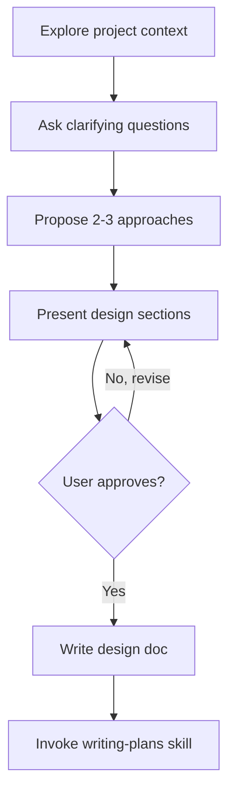

# Brainstorming Ideas Into Designs

## Overview

Help turn ideas into fully formed designs and specs through natural collaborative dialogue.

Start by understanding the current project context, then ask questions one at a time to refine the idea. Once you understand what you're building, present the design and get user approval.

## When to Use

Use this skill when:
- Work will create or modify behavior, features, components, or architecture
- Requirements are incomplete, ambiguous, or still evolving
- You need design approval before any implementation action

> **GATE:** Do NOT invoke any implementation skill, write any code, or take any implementation action until you have presented a design and the user has approved it. For truly trivial changes (rename, config tweak), state the change and get a quick confirmation instead of a full design.

## Process Flow

## Checklist

1. **Explore project context** — check files, docs, recent commits
2. **Ask clarifying questions** — one at a time, understand purpose/constraints/success criteria
3. **Propose 2-3 approaches** — with trade-offs and your recommendation
4. **Present design** — scaled to complexity, get user approval after each section
5. **Write design doc** — save to `docs/plans/YYYY-MM-DD-<topic>-design.md` and commit
6. **Transition to implementation** — invoke `writing-plans` skill

## The Process

**Understanding the idea:**
- Check out the current project state first (files, docs, recent commits)
- Ask questions one at a time to refine the idea
- Prefer multiple choice questions when possible
- Only one question per message
- Focus on understanding: purpose, constraints, success criteria

**Exploring approaches:**
- Propose 2-3 different approaches with trade-offs
- Present options conversationally with your recommendation and reasoning
- Lead with your recommended option and explain why

**Presenting the design:**
- Scale each section to its complexity
- Ask after each section whether it looks right so far
- Cover: architecture, components, data flow, error handling, testing
- Be ready to go back and clarify

## Example

**User**: "사용자 인증 기능을 추가하고 싶어"

**Agent**:
> "인증 기능을 추가하시려는군요. 먼저 프로젝트 구조를 확인하겠습니다."
>
> *(files, package.json 등 확인)*
>
> "현재 Express 기반 API 서버군요. 질문 하나 드릴게요:
> 인증 방식으로 어떤 것을 선호하시나요?
> 1. JWT 토큰 (SPA/모바일에 적합)
> 2. 세션 기반 (전통적, 서버 사이드)
> 3. OAuth2 (Google/GitHub 소셜 로그인)"

## After the Design

**Documentation:**
- Write to `docs/plans/YYYY-MM-DD-<topic>-design.md`
- Commit the design document

**Implementation:**
- Invoke `writing-plans` skill to create implementation plan
- Do NOT invoke any other skill. `writing-plans` is the next step.

## Key Principles

- **One question at a time** — Don't overwhelm
- **Multiple choice preferred** — Easier to answer
- **YAGNI ruthlessly** — Remove unnecessary features
- **Explore alternatives** — Always propose 2-3 approaches
- **Incremental validation** — Present design, get approval before moving on
- **Be flexible** — Go back and clarify when something doesn't make sense

## Related Skills

- **writing-plans** — Creates the implementation plan (always the next step)
- **scientific-brainstorming** — For open-ended research ideation (not code/feature design)
- **research-ideation** — For structured research project planning
